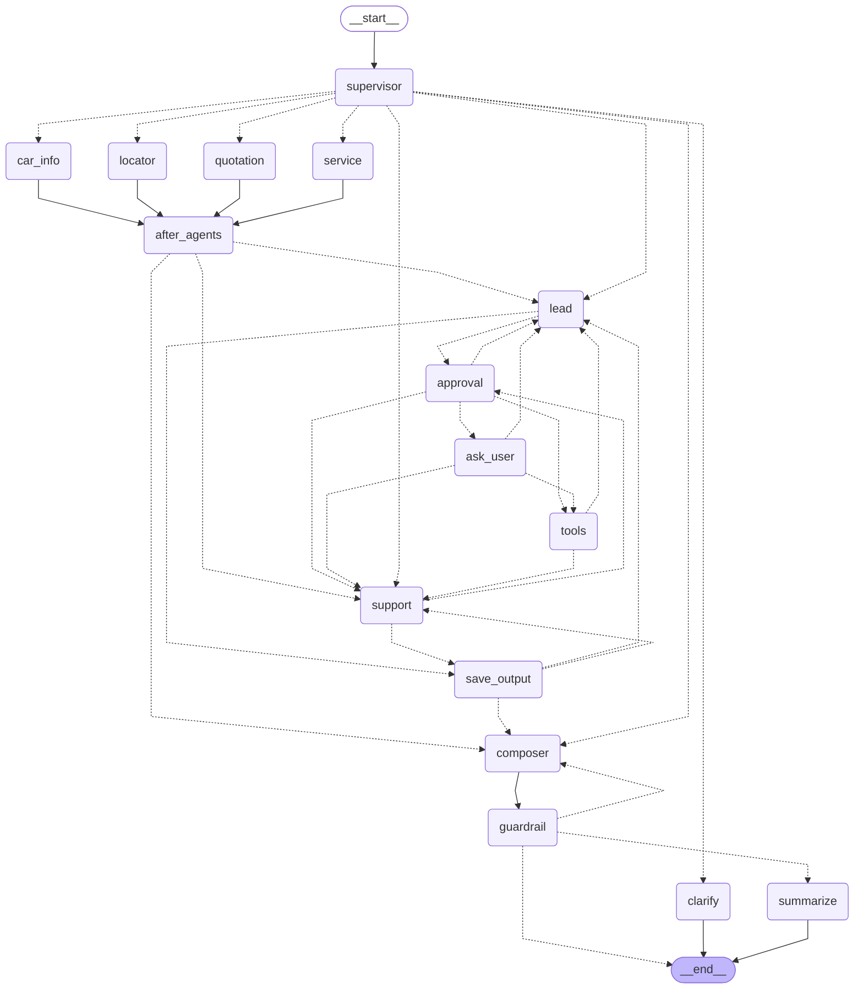

# Graph (generated by `python -m app.graph.build_graph`)

Compare with the flowchart and ROADMAP.md section 4.

```mermaid
---
config:
  flowchart:
    curve: linear
---
graph TD;
	__start__([<p>__start__</p>]):::first
	supervisor(supervisor)
	clarify(clarify)
	car_info(car_info)
	quotation(quotation)
	service(service)
	locator(locator)
	after_agents(after_agents)
	composer(composer)
	guardrail(guardrail)
	summarize(summarize)
	lead(lead)
	support(support)
	approval(approval)
	ask_user(ask_user)
	tools(tools)
	save_output(save_output)
	__end__([<p>__end__</p>]):::last
	__start__ --> supervisor;
	after_agents -.-> composer;
	after_agents -.-> lead;
	after_agents -.-> support;
	approval -.-> ask_user;
	approval -.-> lead;
	approval -.-> support;
	approval -.-> tools;
	ask_user -.-> lead;
	ask_user -.-> support;
	ask_user -.-> tools;
	car_info --> after_agents;
	composer --> guardrail;
	guardrail -.-> __end__;
	guardrail -.-> composer;
	guardrail -.-> summarize;
	lead -.-> approval;
	lead -.-> save_output;
	locator --> after_agents;
	quotation --> after_agents;
	save_output -.-> composer;
	save_output -.-> lead;
	save_output -.-> support;
	service --> after_agents;
	supervisor -.-> car_info;
	supervisor -.-> clarify;
	supervisor -.-> composer;
	supervisor -.-> lead;
	supervisor -.-> locator;
	supervisor -.-> quotation;
	supervisor -.-> service;
	supervisor -.-> support;
	support -.-> approval;
	support -.-> save_output;
	tools -.-> lead;
	tools -.-> support;
	clarify --> __end__;
	summarize --> __end__;
	classDef default fill:#f2f0ff,line-height:1.2
	classDef first fill-opacity:0
	classDef last fill:#bfb6fc
```
